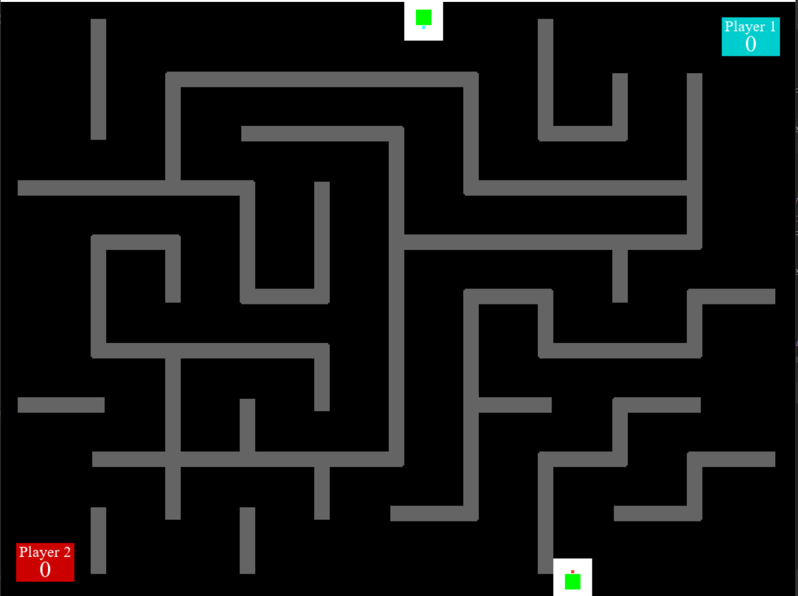
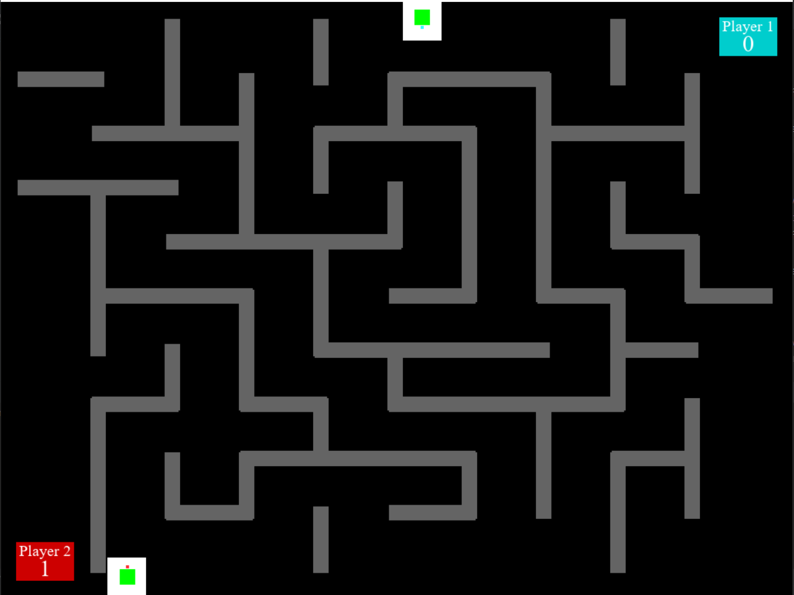
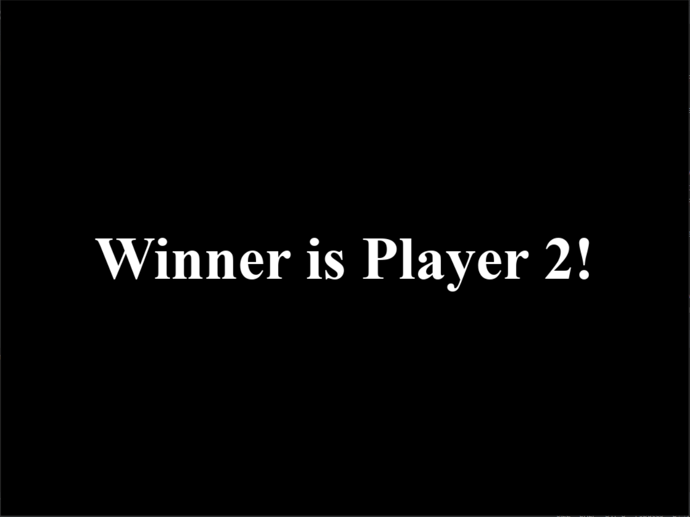

# Tank War

   

## Description
Tank War is a game where two player-controlled tanks battle each other in a fully destructible maze generated via the Recursive Backtracking algorithm. This game was the final project in CS 211 at Northwestern Winter 2020 and as a result, uses a custom game engine GE 211. Further information regarding the controls, tests, and functional requirements can be found in the Evaluation Guide found on the GitHub page.

## Installation 
1. Clone the repository
2. Build tank_war using CMakeLists.txt
3. Run the tank_war

## Player 1 Controls
- Up arrow to move forward (w.r.t. the cannon)
- Down arrow to move backward (w.r.t. the cannon)
- Left arrow to rotate cannon counter-clockwise
- Right arrow to rotate cannon clockwise
- P key to shoot cannon

## Player 2 Controls
- W key to move forward (w.r.t. the cannon)
- S key to move backward (w.r.t. the cannon)
- A key to rotate cannon counter-clockwise
- D key arrow to rotate cannon clockwise
- J key to shoot cannon

## Rules
- The walls of the maze can be destroyed
- Hit the opponent's base or tank with the cannon to win a point
- Roll your tank over the opponent's base to win a point
- First player to 11 points win
